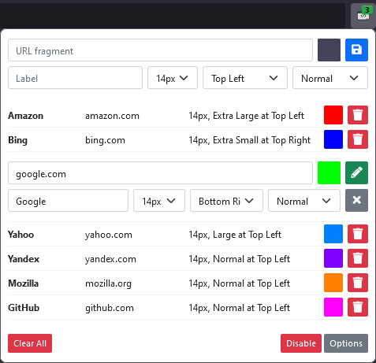

<!-- PROJECT LOGO -->
<p align="center">
  <a href="https://github.com/XjSv/environment-marker">
    
  </a>

  <h3 align="center">Environment Marker</h3>
  <p align="center">
    A Browser Extension
    <br />
    <br />
    <a target="_blank" href="https://addons.mozilla.org/en-US/firefox/addon/environment-marker?utm_source=github&utm_medium=referral&utm_content=get-the-addon-link&utm_campaign=github">Firefox Addons</a>
    .
    <a target="_blank" href="https://chrome.google.com/webstore/detail/environment-marker/cjnmfjkimfbollcepfbhpahipampinhb">Chrome Web Store</a>
    .
    <a target="_blank" href="https://microsoftedge.microsoft.com/addons/detail/environment-marker/iggchogopggbmjgplniemfaghmdkhlip">Edge Add-ons</a>
    ·
    <a target="_blank" href="https://addons.opera.com/en/extensions/details/environment-marker/">Opera addons</a>
    ·
    <a href="https://github.com/XjSv/environment-marker/issues">Report Bug</a>
    ·
    <a href="https://github.com/XjSv/environment-marker/issues">Request Feature</a>
  </p>
  <p align="center"> </p>
</p>


## Table of Contents

- [Table of Contents](#table-of-contents)
- [About The Project](#about-the-project)
  * [Browser Support](#browser-support)
  * [Features](#features)
  * [Built With](#built-with)
- [Installation](#installation)
  * [1 - Install From Firefox.com or the Chromium Web Stores (Recommended)](#1---install-from-firefoxcom-or-the-chromium-web-stores--recommended-)
  * [2 - Build & Install From File (Firefox)](#2---build---install-from-file--firefox-)
- [Development](#development)
- [Usage](#usage)
- [Roadmap](#roadmap)
- [Localization](#localization)
- [Contributing](#contributing)
- [License](#license)
- [Contact](#contact)
- [Acknowledgements](#acknowledgements)


## About The Project

<p align="center">
  
  
</p>

A browser WebExtension that adds a color marker (ribbon) to the page depending on whether the URL contains a given string (e.g. 'ht<span>tp://</span>dev-', 'ht<span>tp://</span>qa-',  'ht<span>tp://</span>prod-').
Currently, this extension supports Firefox and Chromium based browser such as Microsoft Edge, Opera and Brave. Plans are in place to also support Safari in the near future.

### Browser Support
- Firefox
- Chrome & Chromium based browser
  - Microsoft Edge
  - Opera
  - Brave
- Safari (coming soon...)

### Features
* **Configurable Ribbons** - Add a URL or part of a URL, choose a color and a ribbon will be added to the page for any website that matches part of that URL. Here are some examples:

  - github.com
  - ht<span>tps://</span>github.com
  - ht<span>tps://</span>github.com/XjSv/environment-marker
  - ht<span>tp://</span>dev.
  - ht<span>tp://</span>qa.
  - ht<span>tp://</span>prod.
  - environment-marker
  - *.google.com
  - (?<!books).google.com
  
* **Configurable Ribbon Positions** - Choose where to position the ribbon (top left, top right, bottom left, bottom right).
* **Configurable Ribbon Sizes** - Choose one of 5 sizes (extra small, small, normal, large, extra large).
* **Ribbon Labels** - Displays a label on the ribbon.
* **Import/Export** - Export and import ribbon configurations.
* **Multilingual Support** - Currently supports English, Spanish, German & French.
* **Reusable Color Swatch** - The last 7 colors used will be available from the color swatch.
* **RegExp** - When enabled the URL fragment can be used with RegExp instead of searching using indexOf.
* **Tab Counter** - Displays the number of open tabs. Color is green when under 10 tabs and red when above. See <a target="_blank" href="https://github.com/XjSv/environment-marker/wiki/Settings#tab-counter">Settings</a> for more info.
* **Font Picker** - Ability to select fonts for the ribbons. Font come from Google Fonts.

### Built With
* [Font Awesome](https://fontawesome.com/)
* [Pickr](https://simonwep.github.io/pickr/)
* [Bootstrap 5](https://getbootstrap.com/)
* [jQuery Slim](https://jquery.com/)
* [WebExtension browser API Polyfill](https://github.com/mozilla/webextension-polyfill/)
* [he](https://github.com/mathiasbynens/he)
* [fontpicker-jquery-plugin](https://github.com/av01d/fontpicker-jquery-plugin)


## Installation

There are a couple of options for installation.

### 1 - Install From Firefox.com or the Chromium Web Stores (Recommended)
- Firefox: <a target="_blank" href="https://addons.mozilla.org/en-US/firefox/addon/environment-marker/">Environment Marker on Addons.mozilla.org (AMO)</a>
- Chrome: <a target="_blank" href="https://chrome.google.com/webstore/detail/environment-marker/cjnmfjkimfbollcepfbhpahipampinhb">Environment Marker on Chrome Web Store</a>
- Edge: <a target="_blank" href="https://microsoftedge.microsoft.com/addons/detail/environment-marker/iggchogopggbmjgplniemfaghmdkhlip">Environment Marker on Edge Add-ons</a>
- Opera: <a target="_blank" href="https://addons.opera.com/en/extensions/details/environment-marker/">Environment Marker on Opera addons</a>

### 2 - Build & Install From File (Firefox)

**Note:** Pre-built files are available for: 
- Firefox: <a target="_blank" href="https://github.com/XjSv/environment-marker/blob/master/build/environment-marker-firefox.zip">build/environment-marker-firefox.zip</a>
- Chrome, Edge & Opera: <a target="_blank" href="https://github.com/XjSv/environment-marker/blob/master/build/environment-marker-chromium.zip">build/environment-marker-chromium.zip</a>

**Step 1** - Build it
1. Install dependencies
    ``` bash
    npm install
    ```
2. Run the build script
    ``` bash
    npm run build
    ```

**Step 2** - Navigate to: `about:addons`

**Step 3** - Choose the "Install Add-on From File..."
<p align="center">
  
</p>

**Step 4** - Select build/environment-marker-firefox.zip.

## Development
1. Install dependencies
    ``` bash
    npm install
    ```
2. Run the default gulp task
    ``` bash
    gulp
    ```
3. Develop...
4. Run the build script when ready
    ``` bash
    npm run build
    ```

## Usage

See [Usage](https://github.com/XjSv/environment-marker/wiki/Usage) instructions in the [Wiki](https://github.com/XjSv/environment-marker/wiki)  
See [Opera Usage](https://github.com/XjSv/environment-marker/wiki/Opera-Usage) instructions in the [Wiki](https://github.com/XjSv/environment-marker/wiki) for specific Opera related settings.

## Roadmap

See the [open issues](https://github.com/XjSv/environment-marker/issues) for a list of proposed features (and known issues).

## Localization

Localization is done through Crowdin. To contribute to the translations see the [Environment Marker Crowdin](https://crowdin.com/project/environment-marker) project page.

## Contributing

Contributions are what make the open source community such an amazing place to be learn, inspire, and create. Any contributions you make are **greatly appreciated**.

1. Fork the Project
2. Create your Feature Branch (`git checkout -b feature/AmazingFeature`)
3. Commit your Changes (`git commit -m 'Add some AmazingFeature'`)
4. Push to the Branch (`git push origin feature/AmazingFeature`)
5. Open a Pull Request


## License

Distributed under the MPL-2.0 License. See `LICENSE` for more information.


## Contact

Armand Tresova - [@_XjSv_](https://twitter.com/_XjSv_) - atresova@gmail.com

Project Link: [https://github.com/XjSv/environment-marker](https://github.com/XjSv/environment-marker)


## Acknowledgements
* [Font Awesome](https://fontawesome.com/)
* [Pickr](https://simonwep.github.io/pickr/)
* [Bootstrap 5](https://getbootstrap.com/)
* [jQuery Slim](https://jquery.com/)
* [WebExtension browser API Polyfill](https://github.com/mozilla/webextension-polyfill/)
* [he](https://github.com/mathiasbynens/he)
* [fontpicker-jquery-plugin](https://github.com/av01d/fontpicker-jquery-plugin)
