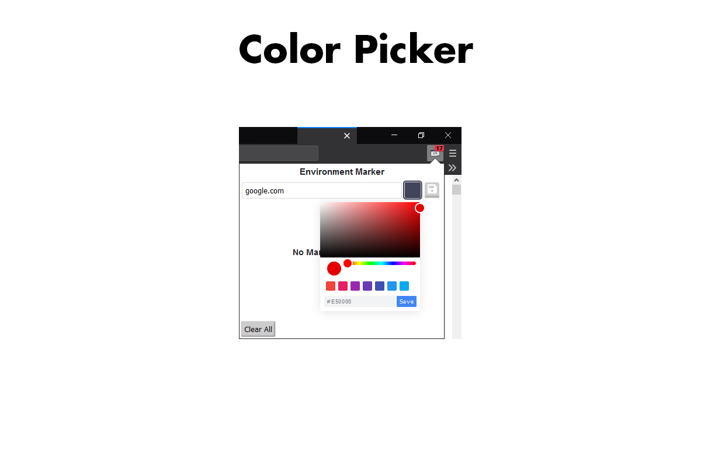

<!-- PROJECT LOGO -->

  

  <h3 align="center">Environment Marker</h3>

  

    A Firefox Addon
     
     
    <a href="https://addons.mozilla.org/en-US/firefox/addon/environment-marker/">Firefox Addons</a>
    ·
    <a href="https://github.com/XjSv/environment-marker/issues">Report Bug</a>
    ·
    <a href="https://github.com/XjSv/environment-marker/issues">Request Feature</a>
  

<!-- TABLE OF CONTENTS -->
## Table of Contents

* [About the Project](#about-the-project)
  * [Built With](#built-with)
* [Usage](#usage)
* [Roadmap](#roadmap)
* [Contributing](#contributing)
* [License](#license)
* [Contact](#contact)
* [Acknowledgements](#acknowledgements)

<!-- ABOUT THE PROJECT -->
## About The Project

A Firefox WebExtension that adds a color marker or ribbon to the top left of a web page depending if the URL contains a given string (e.g. 'http://dev-', 'http://qa-',  'http://prod-'). It uses JavaScript's indexOf to determine if the string is found.

Features:
* Configurable Ribbons - Add a URL or part of a URL, choose a color and a ribbon will be added to the top left of any website that matches part of that URL. Here are some examples:

  - github.com
  - https&#58;//github.com
  - https&#58;//github.com/XjSv/environment-marker
  - http&#58;//dev.
  - http&#58;//qa.
  - http&#58;//prod.
  - environment-marker
  
* Tab Counter - Displays the number of open tabs. Color is green when under 1- tabs and red when above. I plan to make this configurable in the future.

### Built With
* [Firefox Developer Edition](https://www.mozilla.org/en-US/firefox/developer/)
* [Font Awesome](https://fontawesome.com/)
* [Pickr](https://simonwep.github.io/pickr/)

<!-- USAGE EXAMPLES -->
## Usage

Use this space to show useful examples of how a project can be used. Additional screenshots, code examples and demos work well in this space. You may also link to more resources.

_For more examples, please refer to the [Documentation](https://example.com)_

<!-- ROADMAP -->
## Roadmap

See the [open issues](https://github.com/XjSv/environment-marker/issues) for a list of proposed features (and known issues).

<!-- CONTRIBUTING -->
## Contributing

Contributions are what make the open source community such an amazing place to be learn, inspire, and create. Any contributions you make are **greatly appreciated**.

1. Fork the Project
2. Create your Feature Branch (`git checkout -b feature/AmazingFeature`)
3. Commit your Changes (`git commit -m 'Add some AmazingFeature'`)
4. Push to the Branch (`git push origin feature/AmazingFeature`)
5. Open a Pull Request

<!-- LICENSE -->
## License

Distributed under the MPL-2.0 License. See `LICENSE` for more information.

<!-- CONTACT -->
## Contact

Armand Tresova - [@_XjSv_](https://twitter.com/_XjSv_) - atresova@gmail.com

Project Link: [https://github.com/XjSv/environment-marker](https://github.com/XjSv/environment-marker)

<!-- ACKNOWLEDGEMENTS -->
## Acknowledgements
* [Font Awesome](https://fontawesome.com/)
* [Pickr](https://simonwep.github.io/pickr/)